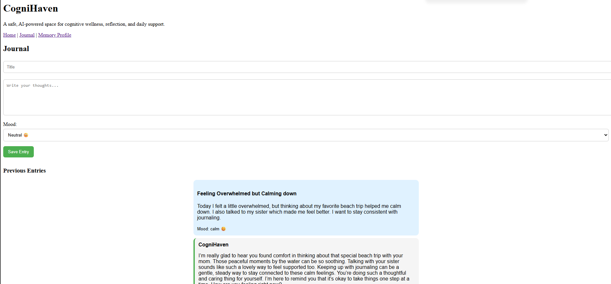
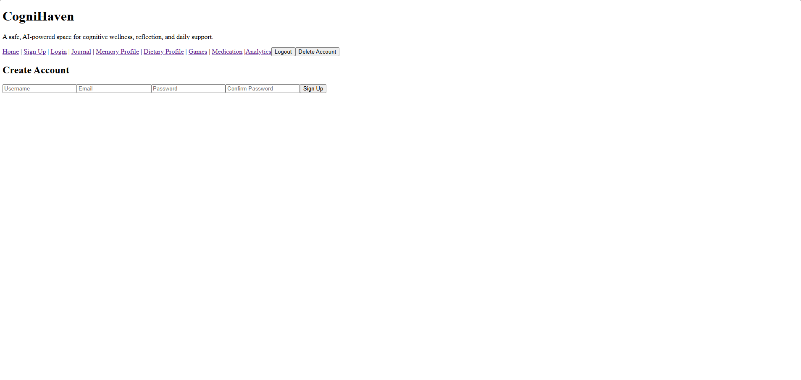

# CogniHaven

A safe, AI-powered space for cognitive wellness, reflection, and daily support.

---

## Overview

CogniHaven is an AI-powered cognitive wellness platform designed to help users build healthy routines, reinforce memory, reflect through journaling, and receive supportive daily assistance.

The platform combines:
- AI-generated supportive reflections
- journaling
- memory reinforcement
- medication reminders
- dietary awareness
- wellness analytics
- cognitive engagement tools

CogniHaven is designed as a supportive wellness platform and does **not** diagnose medical conditions, prescribe medication, or provide unsafe medical advice.

---

## Tech Stack

### Backend

- Java
- Spring Boot
- Spring Security
- Spring Data JPA (Hibernate)
- MySQL
- Maven
- BCrypt Password Hashing
- JWT Authentication
- Spring Boot Mail

### Frontend

- React
- Vite
- JavaScript

### AI Integration

- OpenAI API
- AI-generated contextual reflections
- Dynamic user-context analysis

---

## Architecture

The backend follows a layered architecture:

```txt
Controller → Service → Repository → Database
```

### Packages

- `model` → database entities
- `repository` → data access layer
- `service` → business logic
- `controller` → API endpoints
- `dto` → request/response validation
- `exception` → global exception handling
- `security` → JWT/security configuration

---

## Features Implemented

### Authentication & Security

- JWT-based authentication
- Protected routes using authenticated JWT user context
- BCrypt password hashing
- Email verification system
- Verification token generation
- Auto-login after email verification
- Resend verification email functionality
- Delete account functionality
- Confirm password validation
- Secure DTO-based responses
- Global exception handling

### User Features

- User registration and login
- Secure account management
- Email verification enforcement

### Memory Profile API

- Create/update memory profile
- One-to-one relationship with user
- Supports personalized AI context

### Dietary Profile API

- Create/update dietary profile
- Supports future AI contextual awareness

### Journal System

- Create journal entries
- Retrieve entries by authenticated user
- AI-generated supportive responses
- Existing conversation loading support
- Journal entries sorted newest-first

### Medication Reminder System

- Create medication reminders
- Toggle reminders active/inactive
- Delete reminders
- Multiple reminder times per medication
- Pill metadata support:
  - shape
  - color
  - size

### Notification System

- Scheduled reminder notifications
- In-app popup notifications
- Email reminder notifications
- Notification polling system
- Dismissible notifications

### Game Tracking System

- Initial cognitive game system implemented
- Game result tracking implemented
- Future expansion planned

### Analytics System

- Analytics infrastructure initialized
- Future chart/dashboard improvements planned

---

## Security Features

- BCrypt password hashing
- JWT authentication
- Protected API routes
- DTO validation pattern
- Jakarta Bean Validation
- Global exception handling
- SQL injection protection via JPA repositories
- Verification-token-based email confirmation
- Current-user JWT authorization flows

---

## Database Design

### Tables

- users
- memory_profiles
- dietary_profiles
- medication_reminders
- medication_reminder_times
- journal_entries
- game_results
- ai_analyses
- notifications

### Relationships

#### One-to-One

- User → MemoryProfile
- User → DietaryProfile

#### One-to-Many

- User → JournalEntry
- User → MedicationReminder
- User → GameResult
- User → AIAnalysis
- User → Notification

---

## Frontend Progress

- React + Vite frontend connected to backend APIs
- JWT authentication integrated
- Notification popup system integrated
- Journal system integrated
- Medication system integrated
- Memory profile system integrated
- Dietary profile system integrated
- Email verification flow integrated

---

## AI Vision

CogniHaven is evolving toward a fully AI-aware wellness platform.

The AI system is being designed to understand:
- journal history
- mood patterns
- medication consistency
- dietary preferences
- cognitive game performance
- analytics trends
- overall user engagement

This allows the platform to generate more personalized and supportive wellness insights over time.

---

## Current Status

CogniHaven currently includes:
- working full-stack architecture
- JWT authentication
- email verification
- AI-generated journal reflections
- medication reminders
- notification systems
- profile management systems
- scheduled backend automation

The application is currently transitioning from backend-focused development into:
- improved UX/UI
- analytics visualization
- enhanced cognitive games
- community features
- deployment preparation

---

## Next Steps

- Improve cognitive game experience
- Build analytics charts/dashboard visualizations
- Add Community page
- Add Tailwind/CSS UI overhaul
- Expand AI contextual awareness
- Deploy application to Azure
- Add cloud-hosted database
- Improve accessibility and mobile responsiveness

---

## Future Vision

CogniHaven aims to become a supportive AI-powered cognitive wellness ecosystem where users can:
- reflect
- build healthy routines
- strengthen cognitive engagement
- receive supportive AI guidance
- track wellness trends
- connect with a positive community

The long-term goal is to create a modern, supportive platform focused on cognitive wellness, mindfulness, and daily support.

---

# 🎥 Demos

## Journal System Demo

Click below to watch a demo of the journal system:

[](https://www.youtube.com/watch?v=wLBaWi6hfa8)

---

## Authentication & Email Verification Demo

Click below to watch a demo of the Authentication & Email Verification system:

[](https://youtu.be/Ng3uUpbvEks)
```